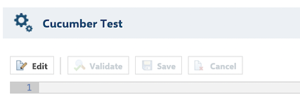

* [Introduction](#introduction)
* [How to use](#how-to-use)
    * [Create tests](#create-tests)
    * [Run tests](#run-tests)
    * [Upload test results](#upload-test-results)
    * [Update feature files](#update-feature-files)
* [Migration existing project from Xray for Jira to Polarion](#migration-existing-project-from-xray-for-jira-to-polarion)

## Introduction

This Polarion extension was created to provide a seamless migration path for teams using Cucumber (Gherkin) test cases in Polarion.
It allows teams to manage their testing processes more effectively by integrating Cucumber (Gherkin) test cases with Polarion's test management capabilities.
It is designed to work with the Polarion REST API and is similar to [Xray for Jira](https://www.getxray.app/).
It provides a way to create, execute, and report on automated tests within the Polarion environment.

The extension allows teams to:

- Define test cases in Cucumber (Gherkin) format inside Polarion WorkItems.
- Link automated tests to Polarion test items.
- Upload test execution results via a REST API (Xray-compatible).
- Integrate seamlessly into CI/CD pipelines.

## How to use

After installing and configuring the extension, it becomes possible to manage Cucumber (Gherkin) test cases in Polarion.

### Create tests

There is a dedicated editor for creating and editing Cucumber (Gherkin) test cases in WorkItem.



This editor allows creation, editing, and validation of test case formats.
It also provides a primitive syntax highlighting and auto-completion for Gherkin keywords.


When the test case is created, it will be saved as an attachment to the current WorkItem.
Attachment name will be generated automatically in the format `<workitem_id>.feature`.

> [!IMPORTANT]
> Test scenarios should be annotated with WorkItem ID.
> It is required to link the test run to the corresponding WorkItem in Polarion.

### Run tests

After creating the test scenarios and binding them to the corresponding test implementation in the project, the tests can be executed within the project.
It will generate a test execution report, which can be uploaded to Polarion.

This extension currently supports the following test execution formats:
 - JUnit report
 - Cucumber report

### Upload test results

Once the test execution is completed, the results can be uploaded to Polarion.
This can be done using the REST API.

For example, if a Cucumber report is available, it can be uploaded using the following command:
```bash
curl -X POST \
  'https://polarion.example.org/polarion/cucumber/rest/raven/1.0/import/execution/cucumber/multipart' \
  -H "Authorization: Bearer $APP_TOKEN" \
  -F "result=@target/cucumber-report.json;type=application/json" \
  -F "info=@info.json;type=application/json"
```

This will upload the test results to Polarion and create a new test execution record.

`info.json` is a file that contains information about the test execution.
It should contain the following fields:
```json
{
  "fields": {
    "project": {
      "key": "project"
    },
    "title": "EXAMPLE-Test execution",
    "description": "EXAMPLE-Test description"
  }
}
```

If the test results are uploaded successfully, a response with a link to the test execution record in Polarion will be provided.

For example:
```json
{
  "testExecIssue": {
    "id": "project/project_20250404-133024032",
    "key": "project_20250404-133024032",
    "self": "https://polarion.example.org/polarion/#/project/project/testrun?id=project_20250404-133024032"
  }
}
```


### Update feature files

If you need to update the feature files in your project, this can be done using the REST API as well.
For this purpose, the /rest/raven/1.0/export/test endpoint can be used.

For example for `project/PRJ-210` and `project/PRJ-211`:
```bash
curl -X GET \
  'https://polarion.example.org/polarion/cucumber/rest/raven/1.0/export/test?keys=project%2PRJ-210%project%2FPRJ-211' \
  -H "Authorization: Bearer $APP_TOKEN"
```
This will return a zip file with the feature files for the specified test cases.

## Migration existing project from Xray for Jira to Polarion

In case of migration from Xray for Jira to Polarion, the [migration tool](https://github.com/SchweizerischeBundesbahnen/jira-to-polarion-migrator) can be used for this purpose.
